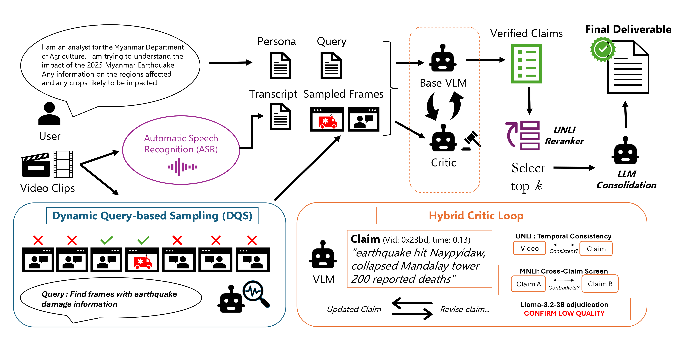

# 🚀 CRAFT Critic-Refined Adaptive Key-Frame Targeting for multimodal video question answering [ACL 2026 MAGMaR Workshop]

[Mahesh Bhosale*](https://bhosalems.github.io/)<sup>1</sup>, [Abdul Wasi*](https://scholar.google.com/citations?user=_2friTYAAAAJ&hl=en)<sup>1</sup>, [Vishvesh Trivedi*](https://github.com/NerdyVisky)<sup>2</sup>, [Pengyu Yan](https://scholar.google.com/citations?user=q2QMx5gAAAAJ&hl=en)<sup>1</sup>, [Akhil Gorugantu](https://scholar.google.com/citations?user=ust_T20AAAAJ&hl=en)<sup>1</sup>, [David Doermann](https://scholar.google.com/citations?user=RoGOW9AAAAAJ&hl=en)<sup>1</sup>.

<sup>1</sup>**University at Buffalo**  |  <sup>2</sup>**New York University**

[Paper](https://arxiv.org/abs/2605.19075v1)

## Overview

CRAFT is a query-conditioned multi-video QA pipeline for real-world news events. It performs multilingual ASR, adaptive keyframe selection, and a hybrid critic loop (UNLI temporal entailment + DeBERTa-v3 cross-claim screen + Llama-3.2-3B adjudicator) to verify and consolidate atomic claims into grounded, citation-backed reports. We evaluate on MAGMaR 2026 and a MAGMaR-style WikiVideo benchmark.

<p align="center">
  
</p>

See [PIPELINE.md](PIPELINE.md) for per-stage methods and [ASR_SETUP.md](ASR_SETUP.md) for the two-environment ASR pre-pass.

---

## 🚀 Quick Start

```bash
git clone https://github.com/bhosalems/CRAFT.git && cd CRAFT
conda create -n craft python=3.13 -y && conda activate craft
pip install -r requirements.txt
```

Then prepare data ([📦 Datasets](#-datasets)) and run the pipeline ([🏃 Running CRAFT](#-running-craft)).

> A separate **general-note** branch ([run_step1_general_notes.py](run_step1_general_notes.py), [run_note.sh](run_note.sh), [run_note_branch_pipeline.py](run_note_branch_pipeline.py)) is present but not end-to-end verified. This README covers only the query branch.

---

## 📦 Datasets

### MAGMaR-2026

We ship a CRAFT-flavoured bundle of MAGMaR-2026 at [🤗 **mbhosale/CRAFT-MAGMaR**](https://huggingface.co/datasets/mbhosale/CRAFT-MAGMaR) — videos (originals + pre-computed chunks), queries, ASR cache, and DKS scores / selected frames in one place:

```bash
export VIDEO_ROOT=/path/to/MAGMaR2026_test
hf download mbhosale/CRAFT-MAGMaR --repo-type dataset \
    --local-dir "$VIDEO_ROOT"
```

The release includes videos (pre-chunked, no further chunking needed), `MAGMaR2026_queries{_dev,}.jsonl`, the ASR cache, and the DKS scores / selected frames. Topic→video mappings ship in this repo.

### WikiVideo (MultiVENT 2.0)

We ship a CRAFT-flavoured bundle of WikiVideo at [🤗 **mbhosale/CRAFT-WikiVideo**](https://huggingface.co/datasets/mbhosale/CRAFT-WikiVideo) — original WikiVideo videos plus our pre-computed chunks, ASR cache, and DKS scores / selected frames in one place. Recommended:

```bash
export WIKIVIDEO_ROOT=/path/to/wikivideo
hf download mbhosale/CRAFT-WikiVideo --repo-type dataset \
    --local-dir "$WIKIVIDEO_ROOT"
```

If you'd rather pull the upstream release and rebuild the CRAFT additions yourself, the source is [🤗 `hltcoe/wikivideo`](https://huggingface.co/datasets/hltcoe/wikivideo) — replace the command above with `hf download hltcoe/wikivideo --repo-type dataset --local-dir "$WIKIVIDEO_ROOT"`, then run the chunking, ASR, and DKS steps below.

Expected layout after either download: `$WIKIVIDEO_ROOT/en/*.mp4` plus `$WIKIVIDEO_ROOT/annotations/{final_data_2015-2025,multivent1_matched_queries_videos}.json`. Synthesised persona queries ([data/wikivideo_queries.jsonl](data/wikivideo_queries.jsonl)) and the pre-built ASR cache ([`asr_wikivideo/`](asr_wikivideo/)) also ship in this repo for convenience. To regenerate the queries, edit the path constants at [generate_wikivideo_queries.py:36-40](generate_wikivideo_queries.py#L36-L40) and re-run the script.

### Chunking

Videos > 120 s are split into `<video_id>__chunk000.mp4`, … (originals untouched). The orchestrators do this automatically. Manual invocation:

```bash
python chunk_videos.py \
    --video-root  "$VIDEO_ROOT" \
    --mapping-in  data/topic_video_mapping_dev.json \
    --mapping-out data/topic_video_mapping_dev_v2.json \
    --chunk-map-out data/video_chunk_map.json \
    --max-seconds 120
```

Needs `ffmpeg`/`ffprobe` on `PATH` (falls back to PyAV). Idempotent. `--force` to recreate. For WikiVideo, swap in `--video-root "$WIKIVIDEO_ROOT/en"` and the `*_wikivideo*` paths.

### ASR cache

Pre-pass. The pipeline only reads from `$ASR_DIR` (set empty to disable). **Pre-built caches ship in this repo** so you can skip the ASR pre-pass entirely:

| Dataset | In-repo path | Files |
|---|---|---|
| MAGMaR-2026 | [`asr_magmar/`](asr_magmar/) | 130 JSON |
| WikiVideo | [`asr_wikivideo/`](asr_wikivideo/) | 421 JSON |

Just point `ASR_DIR` at the relevant directory when you run the orchestrator (the run commands in [🏃 Running CRAFT](#-running-craft) below already do this).

To rebuild from scratch instead:

```bash
# Step 1: Qwen3-ASR (30 langs)
python extract_asr.py --mode qwen \
    --video-root "$VIDEO_ROOT" --mapping data/topic_video_mapping_dev_v2.json \
    --out-dir "$VIDEO_ROOT/asr" --device cuda:0 --verbose

# Step 2: omniASR for `needs_fallback: true` videos (1600+ langs, incl. Burmese/Nepali)
bash setup_asr_omni.sh && conda activate asr_omni
python extract_asr.py --mode omni \
    --video-root "$VIDEO_ROOT" --mapping data/topic_video_mapping_dev_v2.json \
    --out-dir "$VIDEO_ROOT/asr" --verbose
```

Two envs are required because `omnilingual-asr` pins `fairseq2` ≤ 0.6 (torch ≤ 2.9.1) while the main env runs torch 2.10+cu128. See [ASR_SETUP.md](ASR_SETUP.md).

### Dynamic Keyframe Selection (DKS, optional)

For each `(query, video)` pair, DKS scores every frame with CLIP (`openai/clip-vit-base-patch32`), picks the top-`N`, and re-encodes them as a short query-specific clip the VLM consumes in place of the full chunked video. DKS gains show up only when the VLM's frame budget is also constrained — we evaluate it at `MAX_FRAMES=64` (MAGMaR) and `MAX_FRAMES=32` (WikiVideo), versus the 128-frame reference. Built on AKS (Tang et al., [arXiv:2502.21271](https://arxiv.org/abs/2502.21271), CVPR 2025). CRAFT-adapted code in [`AKS/`](AKS/).

**Prep** (set `N=64` for MAGMaR, `N=32` for WikiVideo):

```bash
# 1. Score frames per (query, video) pair (parallel across N_GPUS)
NUM_GPUS=8 DATASET_PATH="$VIDEO_ROOT" MODEL=clip DATASET_NAME=magmar2026 \
TOPIC_MAPPING=data/topic_video_mapping_dev_v2.json \
QUERIES="$VIDEO_ROOT/MAGMaR2026_queries_dev.jsonl" \
OUTPUT_FILE="$VIDEO_ROOT/outscores" \
    bash AKS/run_parallel_extract.sh
python AKS/merge_shards.py --scores_dir "$VIDEO_ROOT/outscores/magmar2026/clip"

# 2. Select top-N frames
python AKS/frame_select.py --dataset_name magmar2026 --extract_feature_model clip \
    --score_path "$VIDEO_ROOT/outscores/magmar2026/clip/scores.json" \
    --frame_path "$VIDEO_ROOT/outscores/magmar2026/clip/frames.json" \
    --max_num_frames 64 --output_file "$VIDEO_ROOT/selected_frames"

# 3. Cut per-(query, video) clips
python AKS/cut_aks_clips.py \
    --selected_frames "$VIDEO_ROOT/selected_frames/magmar2026/clip/selected_frames.json" \
    --meta            "$VIDEO_ROOT/outscores/magmar2026/clip/meta.json" \
    --source_video_root "$VIDEO_ROOT" --out_root "$VIDEO_ROOT/dks_clips" \
    --queries "$VIDEO_ROOT/MAGMaR2026_queries_dev.jsonl" --output_fps 1.0
```

**Run** with DKS on — point `AKS_VIDEO_ROOT` at the cut clips and cap `MAX_FRAMES`:

```bash
AKS_VIDEO_ROOT="$VIDEO_ROOT/dks_clips" MAX_FRAMES=64 \
PARALLEL_QUERIES=8 PARALLEL_STEP15=8 PARALLEL_STEP5=8 \
    bash run_query.sh outputs/craft_magmar_dks
```

(Same pattern for WikiVideo with `MAX_FRAMES=32` and `run_query_wikivideo.sh`.) The resolver falls back to the chunked source when a DKS clip is missing, so partial coverage is non-blocking. For WikiVideo, we ship pre-computed scores + selected frames in [🤗 `mbhosale/CRAFT-WikiVideo`](https://huggingface.co/datasets/mbhosale/CRAFT-WikiVideo) under `aks/{outscores,selected_frames}/wikivideo/clip/` — only step 3 (clip cutting) is needed.

### Data files

| File | Purpose |
|---|---|
| `data/topic_video_mapping{_dev,_test,}.json` | MAGMaR topics → video IDs (pre-chunk) |
| `data/topic_video_mapping*_v2.json` | post-chunk variant. Auto-derived by `run_query.sh` |
| `data/video_chunk_map{_wikivideo,}.json` | chunk-id → `{video_id, start, end}` (parent-id remap at output time) |
| `data/topic_video_mapping_wikivideo{,_dev}.json` | WikiVideo events → video IDs |
| `data/wikivideo_queries{,_dev}.jsonl` | synthesised persona queries (`query_id`, `query_type`, `language`, `title`, `persona_title`, `background`, `query`) |
| `data/dev/` | smoke-test fixtures |

---

## 🏃 Running CRAFT

`PARALLEL_*` should match your visible GPU count (drop to `1` for single-GPU). All other knobs ship at the reference values. See [Configuration defaults](#configuration-defaults).

### MAGMaR-2026

```bash
export VIDEO_ROOT=/path/to/MAGMaR2026_test
ASR_DIR=./asr_magmar \
PARALLEL_QUERIES=8 PARALLEL_STEP15=8 PARALLEL_STEP5=8 \
    bash run_query.sh outputs/craft_magmar_main
```

Outputs: per-query reports at `outputs/craft_magmar_main/reports_query_based/all_reports.json` and a MAGMaR-format JSONL at `outputs/craft_magmar_main/submission.jsonl` for MIRAGE.

### WikiVideo

Same orchestrator. Stage 1b defaults to `Qwen/Qwen3-VL-30B-A3B-Instruct-FP8`, Stage 2b stays on `Qwen/Qwen3.5-9B`.

```bash
export WIKIVIDEO_ROOT=/path/to/wikivideo
SKIP_CHUNK=1 \
VIDEO_ROOT="$WIKIVIDEO_ROOT/en" ASR_DIR=./asr_wikivideo \
PARALLEL_QUERIES=8 PARALLEL_STEP15=8 PARALLEL_STEP5=8 \
    bash run_query_wikivideo.sh outputs/craft_wikivideo_main
```

### Configuration defaults

| Env var | MAGMaR | WikiVideo | Controls |
|---|---|---|---|
| `MODEL_NAME` | `Qwen/Qwen3.5-9B` | `Qwen/Qwen3-VL-30B-A3B-Instruct-FP8` | Stage 1b extractor (Hydra `model.model=…`) |
| `STAGE2_MODEL_NAME` | `Qwen/Qwen3.5-9B` | `Qwen/Qwen3.5-9B` | Stage 2b consolidator |
| `MAX_CRITIC_ROUNDS` | `4` | `4` | per-video critic re-extraction rounds |
| `COVERAGE_FOLLOWUP_ROUNDS` | `1` | `1` | re-prompts when coverage gaps are flagged |
| `CRITIC_NLI_ENABLED` / `CRITIC_COVERAGE_ENABLED` | `true` | `true` | DeBERTa-v3 contradiction screen / Llama-3.2-3B coverage audit |
| `STEP15_CHUNK_SIZE` | `10` | `10` | Stage 1.5 sub-batch size |
| `MAX_FRAMES` | `128` | `128` | Stage 1b VLM frame budget (Hydra `runtime.max_frames`). Drop to `64` (MAGMaR) or `32` (WikiVideo) when running with DKS |
| `GPU_MEM_UTIL` | `0.85` | `0.85` | vLLM `gpu_memory_utilization` |
| `PARALLEL_QUERIES` / `_STEP15` / `_STEP5` | `1` | `1` | parallel workers (set to GPU count) |
| `ASR_DIR` | `$VIDEO_ROOT/asr` | same | empty disables ASR |
| `AKS_VIDEO_ROOT` | unset | unset | when set, the resolver prefers `$AKS_VIDEO_ROOT/q<query_id>/<video_id>.mp4` over the chunked source (enables DKS — see [Dynamic Keyframe Selection](#dynamic-keyframe-selection-dks-optional)) |
| `SKIP_CHUNK` / `SKIP_STEP1` | `auto` | `auto` | `1` = skip, `auto` = skip if outputs exist |

Atomic claims are produced by the prompts ([prompts.py](prompts.py)). The post-hoc `format_submission.py --atomize` splitter is off by default. The Hydra config ([conf/step1_query_claims.yaml](conf/step1_query_claims.yaml)) also defaults to MAGMaR (`override /model: qwen3_5_vl`) for direct invocations of `run_step1_query_claims.py`. Orchestrators override at runtime via `model.model=$MODEL_NAME`.

---

## Evaluation

We score CRAFT with the **MIRAGE** judge (Qwen2.5-7B-Instruct) on `info_f1` and `cite_f1`. A copy of MIRAGE ships in this repo at [`mirage/`](mirage/) with its own conda env (Python 3.12, separate from the `craft` env).

### Setup

```bash
# Option A: conda env file (pins system libs too)
conda env create -f mirage/eval_env_9_20_25.yml
conda activate video_rag_eval

# Option B: fresh env + pip
conda create -n video_rag_eval python=3.12 -y && conda activate video_rag_eval
pip install -r mirage/requirements.txt
```

### Run

Edit the `PRED` / `REF` / `OUT` / `VIDEO_DIR` paths at the top of [`mirage/run_magmar.sh`](mirage/run_magmar.sh) and [`mirage/run_wikivideo.sh`](mirage/run_wikivideo.sh) to point at your CRAFT outputs and the dataset videos, then:

```bash
conda activate video_rag_eval
bash mirage/run_magmar.sh        # reference InfoF1 + CiteF1 on MAGMaR
bash mirage/run_wikivideo.sh     # same on WikiVideo
```

Both scripts invoke `mirage/infof1.py` and `mirage/citef1.py` with `--eval_type reference --model_name qwen_7b`. The collection-eval branch is commented out by default (VLM-grounded, expensive). See [`mirage/README.md`](mirage/README.md) for the full evaluator documentation.

---

## Acknowledgements

- **WikiVideo** ([repo](https://github.com/alexmartin1722/wikivideo), [paper](https://arxiv.org/abs/2504.00939)) and the **MultiVENT 2.0** team at HLTCOE for the multilingual news-event video collection, distributed at [🤗 hltcoe/wikivideo](https://huggingface.co/datasets/hltcoe/wikivideo).
- **MIRAGE** for the multimodal RAG evaluation framework used as our scorer.
- **Adaptive Keyframe Sampling** (Tang et al., [arXiv:2502.21271](https://arxiv.org/abs/2502.21271), CVPR 2025) — the upstream scoring algorithm we build on for our **Dynamic Keyframe Selection (DKS)** module. Code lives under [`AKS/`](AKS/) (directory name preserved from the upstream fork). Our CLIP variant uses `openai/clip-vit-base-patch32`.
- **Qwen** team for Qwen3.5-9B and Qwen3-VL-30B-A3B-Instruct-FP8 (extractors), Qwen3-ASR-1.7B (speech), and the Qwen2.5-7B-Instruct MIRAGE judge.
- **`AdoptedIrelia/UNLI`** (UNLI base + LoRA, Qwen2.5-Omni-3B backbone) for video-grounded entailment scoring.
- **MoritzLaurer/DeBERTa-v3-base-mnli-fever-anli** and **meta-llama/Llama-3.2-3B-Instruct** for cross-claim contradiction screening and adjudication.
- **Meta AI** for omniASR-LLM-7B and the `fairseq2` / `omnilingual-asr` stack used in our multilingual ASR fallback.

---

## Citation

```bibtex
@article{bhosale2026craft,
  title={CRAFT: Critic-Refined Adaptive Key-Frame Targeting for Multimodal Video Question Answering},
  author={Bhosale, Mahesh and Wasi, Abdul and Trivedi, Vishvesh and Yan, Pengyu and Gorugantu, Akhil and Doermann, David},
  journal={arXiv preprint arXiv:2605.19075},
  year={2026}
}
```
